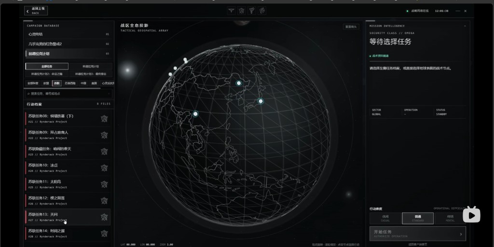

# 战役界面平面化设计与交付方案

> **日期**：2026-08-15（同日补充：参考帧元素规范、§8 主题架构、§9 交互方案、§10 3D 外部模块化）  
> **范围**：以**战役选择界面（CampaignSelector）**为试点，建立可复用的「战术指挥台 / 平面未来感」视觉语言；顺带约定主菜单入口与后续大厅迁移边界。  
> **章节导航**：§8 = Classic/Tactical 双主题代码架构；§9 = 全流程交互方案（本次新增重点）；§10 = 3D 场景外部模块化与分支策略。  
> **主视觉参考（定调）**：  
> - [Bilibili BV1x6uv6NEN4](https://www.bilibili.com/video/BV1x6uv6NEN4/) 视频中的战役选择方案（本仓库存档帧：`Docs/design/assets/campaign-ui-reference-tactical-globe.png`）  
> - 辅参考：[RT 档案馆 · sovietianqi.github.io](https://sovietianqi.github.io/)（分区与信息站气质）  
> **约束前提**：启动器大量控件仍依赖 PNG 贴图；风格调整优先走 **Avalonia 模板 / 主题色板 / 少改或不改 INI 坐标**；中栏「**透视线框地球**」为增强层（完成态 L1 数学投影，L0 仅允许透视预渲染静帧占位），可与现有任务预览并存。  
> **不做**：本文件只出设计与交付计划，**不改业务逻辑 / 不改 spawn / 不改 Battle.ini 解析**。

---

## 0. 一句话结论

战役界面已经是「**INI 定布局 + Avalonia DataTemplate 定皮**」；重构后的 `CampaignOverlayController` / Behaviors / 稳定控件 ID 让换皮可以**几乎不碰启动逻辑**。视频方案把目标钉死为：**纯黑底 + 细线框 + 冷青点缀 + 三栏战术台（列表 / 地球 / 简报）**，而不是继续沿用暖棕半平面壳。难点在：**旧 PNG 与该语言冲突**，以及 **中栏透视线框地球**（完成态是投影/真 3D，不是平面底图）的实现成本。交付应走「色板与线型规范 → 三栏信息架构 → chrome 平面化 → 透视地球 L1 → 动效」分层推进。



---

## 1. 当前实现分析

### 1.1 结构（重构后）

```
主菜单 btnNewCampaign
  → OpenCampaignOverlay()
  → 浮动层加载 CampaignSelector.ini
  → CampaignOverlayBehaviors（点击 / 阵营筛选 / 难度）
  → CampaignOverlayController.ApplyCampaignOverlay
       → GameDataBindingApplier（任务列表 / 简介 / 预览 / 阵营 Tab）
  → btnLaunch → GameLaunchController.TryLaunchCampaign
       → CampaignSpawnWriter（游戏逻辑，换皮不动）
```

| 层级 | 职责 | 换皮时是否应动 |
|---|---|---|
| `CampaignSelector.ini` | 尺寸、锚点、背景图路径、按钮贴图名 | 尽量少动；只调间距/是否去掉 IdleTexture |
| `DxCampaignStyles.axaml` | 根壳、列表、简介、阵营 Tab、难度条、主次按钮模板 | **主战场** |
| `DxOfficialTheme.axaml` | `DxCampaign*` 色刷 / 渐变 | **主战场**（改为冷青战术令牌） |
| `DxNodeTemplateSelector` | 控件 ID → DataTemplate | 可扩展；地球层用新宿主控件 |
| `CampaignOverlayController` / Behaviors | 筛选、难度、关闭、启动 | **原则上不动** |
| `CampaignSpawnWriter` / `MissionCatalogLoader` | 开局与任务数据 | **不动** |

稳定控件 ID（契约，换皮必须保留）：

| ID | 作用 |
|---|---|
| `lbCampaignList` | 任务列表 |
| `tbMissionDescription` | 简介 + 预览 |
| `trbDifficultySelector` | 难度 0–2 |
| `btnLaunch` / `btnCancel` | 开始 / 取消 |
| `GDI` / `Nod` / `ThirdSide`（及可选 `FourthSide`） | 阵营筛选（MG：同盟 / 苏军 / 阿克维尔） |
| `lblSelectCampaign` / `lblMissionDescriptionHeader` / `lblDifficultyLevel` 等 | 分区标题 |

### 1.2 视觉现状（混合态）

仓库内已有一版「半平面」战役皮：

- 根壳：INI 背景图 `MainMenu/dbak.png` **降到约 0.28 透明度**，上覆深色渐变 + 顶条强调色（`DxCampaignRoot`）。
- 列表 / 简介：Avalonia `ListBox` + Border，**不再依赖列表皮肤 PNG**。
- 难度：XAML Slider；旧 DX 难度滑块贴图已刻意清空。
- 启动 / 取消：INI 仍指向 `147pxbtn.png`，模板里用渐变按钮叠低透明贴图 → **旧按钮图与平面皮打架**。
- 阵营 Tab：XAML 胶囊 + 可选 `{SideName}icon.png`。
- 任务预览：场景 PNG（`Maps/Campaign` 等），缺图回退 `nopreview.png`。

色板现状（`DxOfficialTheme.axaml`）：偏**暖棕 / 橙强调**（`#FF8C32`、`#FFD4A8`），与视频参考的**纯黑 + 冷青**战术台差距大，需整体换令牌而非微调。

### 1.3 图片依赖盘点（战役相关）

| 表面 | 资源 | 对平面化的阻碍 |
|---|---|---|
| 主菜单入口 | `MainMenu/campaign.png`（+ hover） | 写实/旧 UI 按钮，与平面 overlay 入口不一致 |
| Overlay 背景 | `MainMenu/dbak.png`（或 MG 侧其它 bg） | 与纯黑战术台冲突；Flat 模式应**禁用或透明度≈0** |
| 启动/取消 | `147pxbtn.png` / `_c` | 立体按钮皮；必须**弃用贴图、纯线框/实心 XAML** |
| 阵营图标 | `{SideName}icon.png` | 改为线稿徽或保留小图标贴在直角框内 |
| 任务预览 | 场景 PNG / `nopreview` | 参考方案中栏是地球而非预览图；见 §3.5 并存策略 |
| 难度滑块 | 旧 trackbar PNG（Avalonia 已不用） | 改为三段矩形 Segment |

结论：**chrome 全面效仿视频线框语言；写实预览降级为可选侧车或详情区缩略图；中栏视觉锚点改为地球/战术图。**

### 1.4 架构为何方便接入

1. **视觉与逻辑已拆开**：换 `ResourceDictionary` / Template 即可换皮，Behaviors 仍按 ID 点选。  
2. **浮动 Overlay 路径独立**：战役不进 `UiBehaviorCatalog` 的「空 Stub」主窗路径，改皮不会误伤大厅。  
3. **数据绑定集中**：`ApplyCampaignOverlay` 只写列表项 / 简介 / 选中态；新 UI 只要继续填同一 VM 字段即可。  
4. **后续可接 `IMissionSession`**：今日战役状态仍在 `LobbySessionState`；地球节点、通关态等可落 Session，不必塞进 View。

---

## 2. 风格目标（效仿视频：战术指挥台）

### 2.1 参考帧定调（已确认方向）

视频方案不是「圆角渐变卡片」，而是 **HUD / 卫星指挥台**：

| 维度 | 参考表现 | 我们的落地约束 |
|---|---|---|
| 底色 | 纯黑，几乎无纹理 | Flat 模式关闭 `dbak` |
| 结构线 | 1px 灰白细线；转角常**断开**或带小方块 | 自定义 Border / Path，避免厚圆角卡片 |
| 强调色 | **冷青/青绿** = 选中、在线、节点；**红** = 任务名/告警点缀 | Accent=Cyan；Danger/TitleAccent=Red |
| 渐变/阴影 | 基本没有 | 删除现有暖橙 Gradient 主按钮 |
| 字体 | 硬朗无衬线；英文常全大写 + 字距 | 标题英文大写；中文保持可读 |
| 布局 | **左列表 · 中地球 · 右简报+难度+授权** | 见 §3.1；窗口建议加宽 |

### 2.2 可执行原则（更新）

| 原则 | 含义 | 战役落地 |
|---|---|---|
| **三栏战术台** | 导航 / 态势 / 简报 各司其职 | 左 Action Files · 中 Globe · 右 Intelligence |
| **细线几何** | 直角或微切角，断线角、角标方块 | 面板框、列表行、按钮 |
| **双强调色** | 青=交互态；红=任务标题/关键标签 | 勿再使用暖橙作主 Accent |
| **状态即交互** | Hover/Selected 靠半透明底 + 加粗边，不换 PNG | 全 XAML |
| **信息密度可控** | 列表有主/副标题；右侧有状态表 | 副标题用代号/阵营；表用已有字段 |
| **动效克制** | 地球慢旋、节点脉冲、选中淡入 | 无粒子墙；地球可关 |

### 2.3 与「全图按钮启动器」的关系

| 策略 | 说明 |
|---|---|
| **A. 战役试点战术台（推荐）** | 战役 Overlay 按视频语言重皮；主菜单入口二期 |
| **B. Classic / Tactical 双皮** | 设置项切换；Tactical 忽略按钮贴图与 dbak |
| **C. 全客户端重绘** | 战役验证后再推广令牌 |

默认 **A**，预留 **B**。

### 2.4 色板定稿建议（Tactical / 冷青）

> **2026-08-15 拍板更新**：色板不再写死。**主色可配置**（主题文件或用户设置），**点缀色 = 主色反色**（色相环 180° 互补），由 `DxThemeManager` 运行时计算并写入 `DxAccentInverseBrush`。下表为 Tactical 默认值（冷青主色 → 反色即偏红，恰与参考帧一致）。

| Token | 建议值（可微调） | 用途 |
|---|---|---|
| `Surface/0` | `#000000` / `#050608` | 根底 |
| `Surface/1` | `#0A0C10` | 抬升面板（几乎仍黑） |
| `Surface/selected` | `#1A1A1A`～`#222` 半透明 | 列表选中底 |
| `Line/primary` | `#C8C8C8` / `#8A8A8A` | 1px 结构线 |
| `Line/muted` | `#3A3A3A` | 次级分割 |
| `Accent/primary`（可配置） | `#2EE6C5`～`#3DFFD0` | 节点、选中边、在线灯、主 CTA 字/箭头 |
| `Accent/inverse`（自动反色） | ≈`#FF3B6B`（由主色旋转 180°） | 任务主标题、告警、部分分类 |
| `Text/primary` | `#F2F2F2` | 正文 |
| `Text/muted` | `#7A7A7A` | 副标题、LAT/LON、表头 |
| `Text/label-en` | `#9A9A9A` + LetterSpacing | 全大写英文标签 |

反色算法（`DxThemeManager` 内实现，写入主题字典）：

```csharp
// HSV 色相旋转 180°，保持 S/V；过灰（S<0.15）时回退为亮度反转，保证可辨
static Color InvertHue(Color c) { ... }
```

阵营识别：用**细色点 / 左边线**区分同盟/苏军/阿克维尔，避免大色块破坏黑底。

---

## 3. 平面元素设计规范（效仿参考帧）

### 3.1 布局骨架（三栏）

```
┌──────────────────────────────────────────────────────────────────────────┐
│ [←]   ◆ ◆ ◆ ◆ ◆ ◆ ◆          STRATEGIC NETWORK ONLINE  ●    12:00:00   │ 顶栏
├────────────────────┬─────────────────────────────┬───────────────────────┤
│ CAMPAIGN DATABASE  │                             │ MISSION INTELLIGENCE  │
│ [心灵终结][RA2]…   │      ┌─────────────┐        │ 等待选择任务 / 任务名 │
│                    │      │  线框地球    │        │ 战术简报正文         │
│ ACTION FILES       │      │  青节点+连线 │        │                      │
│ ▸ 苏联任务08…  [徽]│      │  LAT LON ZOOM│        │ SECTOR|OPERATION|STATUS│
│   A21 // Project   │      └─────────────┘        │ …表行…               │
│ …                  │   TACTICAL GEOSPATIAL ARRAY │                      │
│                    │                             │ OPERATIONAL DIFFICULTY│
│                    │                             │ [休闲][普通][极难]    │
│                    │                             │ [ AUTHORIZE → ]       │
└────────────────────┴─────────────────────────────┴───────────────────────┘
```

相对现状的硬变化：

1. **从双栏（列表+简介）升级为三栏**；中栏是视觉锚点。  
2. **难度 = 三段直角 Segment**（休闲 / 普通 / 极难），对应现有难度 0–2。  
3. **主 CTA** 文案可中英：`开始任务` / `AUTHORIZE OPERATION`，右侧箭头，线框或青字强调。  
4. **窗口尺寸**：672×600 过窄；建议战术台至少 **960×640** 或全屏浮层（INI Size 或模板内忽略 Width 用星号铺满 Overlay）。

### 3.2 原子组件规格（按参考帧拆解）

| 组件 | 参考表现 | 规格要点 | Avalonia 落点 |
|---|---|---|---|
| **顶栏 Status Bar** | 返回、中部图标组、在线状态+时间 | 高 36–44；1px 底部分割；在线灯用 Accent/cyan 圆点 | 新宿主导航条（可映射 `btnCancel` 为返回） |
| **断线角面板** | 框线在转角处断开、小方块锚点 | 用 `Path`/`Border`+装饰 Rectangle，圆角≈0–2 | 左/右栏外壳 |
| **数据库标题** | `CAMPAIGN DATABASE` 大写+字距 | Text/muted 小标签 + Text/primary 标题 | `lblSelectCampaign` 模板 |
| **分类芯片** | 直角描边按钮（全部任务 / 计划名） | 未选：1px Line；选中：加粗或青边 | 可映射阵营 Tab 或新增分类（二期） |
| **Action File 行** | 主标题偏红/白；副标题代号；右侧线徽 | 两行文字；选中半透明灰底；Hover 略亮 | `lbCampaignList` ItemTemplate |
| **线框地球** | **透视**经纬网格球、青节点、细连线、慢旋 | 见 §3.3（非平面底图） | 新控件 `TacticalGlobeView` |
| **态势标注** | `LAT` `LON` `ZOOM` | 等宽数字、muted 色 | 地球宿主底部 |
| **Intelligence 头** | 大标题 + 简报 | 未选中显示「等待选择任务」 | `tbMissionDescription` 重排 |
| **状态表** | SECTOR / OPERATION / STATUS | 三列细线表；无斑马纹厚底 | Briefing 内 ItemsControl |
| **难度 Segment** | 三枚并排直角钮 | 选中边加粗发亮；文案中+英 | `trbDifficultySelector` 模板改 Segment |
| **Authorize CTA** | 宽按钮+箭头 | 禁用时降透明；无 PNG | `btnLaunch` |
| **分段线性饰条** | 顶栏/分节旁短线、进度感线段 | 纯装饰，1px | 标题旁 |

### 3.3 中栏：透视线框地球（核心新元素）

参考帧中栏是 **Tactical Geospatial Array**：**带透视的线框球体**，不是任务预览 PNG，也**不是**一张正投影/贴图式「平面地球底图」。

#### 3.3.1 参考帧里「透视」具体指什么

从存档帧可观察到（实现必须对齐这些特征，而不能用扁椭圆贴图糊弄）：

| 特征 | 表现 | 含义 |
|---|---|---|
| **球体轮廓** | 接近正圆外轮廓，但纬线是**椭圆弧**（近大远小） | 有相机透视 / 斜视投影，不是正视图平面圆+平行纬线 |
| **经线会聚** | 经线向可见极点方向收束，背面经线更密或被遮挡 | 三维球面上的参数曲线，经投影到 2D |
| **前后景深** | 面向相机一侧的网格更亮/更疏，远侧更淡、更挤 | 需深度或法线衰减（假 3D 也要模拟） |
| **节点贴在球面上** | 青点沿曲面分布，边缘点呈椭圆压缩，不是屏幕均匀撒点 | 节点是 **球面 UV / 经纬坐标 → 投影**，不是 UI 绝对像素随机点 |
| **连线贴面或弦线** | 点与点之间细青线，随球面弯曲或走大圆弧弦 | 同样走球面几何再投影 |
| **可慢旋** | 视频/交互中球体有转动感 | 必须能改 **yaw（及可选 pitch）** 后重投影；纯静帧 PNG 无法真转（除非序列帧） |

因此文档早期写的「L0 = 一张静态底图 + 叠点」**只能当占位**，**不能**当作对标完成态。完成态至少是 **实时（或伪实时）透视投影的线框球**。

#### 3.3.2 实现分层（纠正后）

| 层级 | 方案 | 是否具备透视 | 成本 | 说明 |
|---|---|---|---|---|
| **L0 占位（仅联调 UI）** | 单帧**已带透视**的预渲染线框球图（从 Blender/Three 导出一张）+ 固定装饰点 | 有（烘进图里） | 低 | **不能旋转、节点不能贴面运动**；只允许 P1 联调三栏布局时暂用 |
| **L1 假 3D / 数学投影（推荐目标）** | CPU：球面经纬网格 → 透视投影矩阵 → Avalonia `StreamGeometry`/`Path` 描线；节点用经纬 → 同矩阵投影；每帧或拖动时重算 | **有** | 中 | **无 GPU 依赖**；可慢旋、选中高亮、深度淡出；包体小。推荐作产品默认 |
| **L1b 预渲染序列** | 水平 36～72 帧透视线框球 + 按角度切帧；节点仍实时投影叠上去 | 有（帧内） | 中高 | 旋转更「电影」但包体与接缝要处理；节点层仍建议 L1 数学 |
| **L2 真 3D** | Avalonia 内嵌自定义渲染（Skia 3D / OpenGL / 独立控件）画线框 mesh | 有 | 高 | 仅当 L1 在精度/性能不够时立项；避免为客户端拉 WebGL/Three.js |

**推荐路径：** P1 三栏可用 L0 **透视预渲染静帧**占位 → **P1.5 上 L1 数学透视球**（真正对标参考）→ 视效果再评估 L1b/L2。

#### 3.3.3 L1 数学透视球（规格草案）

```
输入：yaw, pitch, 半径 R, 焦距 f（或 FOV）, 经线数 M, 纬线数 N
对每个球面点 (θ, φ)：
  世界坐标 → 相机空间 → 透视除法 (x' = f·x/z, y' = f·y/z)
  若 z 背向相机：不画或降透明（背面裁剪 / 深度淡出）
经线/纬线：折线连接投影点，用 1px Stroke = Line 或 Accent/cyan（低透明）
任务节点：每任务绑定 (lat, lon) 或哈希散布到球面 → 同投影；前方点实心青，边缘缩小
连线：两节点大圆弧采样若干点再投影，或简单弦线（屏幕空间）
慢旋：CompositionTarget.Rendering / DispatcherTimer 改 yaw
```

| 子项 | 建议 |
|---|---|
| 网格密度 | 经线 18–24，纬线 12–16（过密变乱） |
| 线宽 | 1 物理像素；勿粗描边 |
| 背面 | 透明度 0.15–0.35 或直接裁掉 |
| 节点 | 半径 2–4px；选中外环脉冲 |
| 命中测试 | 屏幕空间最近邻节点（投影后 2D 距离） |
| 降级 | 低配关旋转、减半网格；极低配回退 L0 静帧 |

#### 3.3.4 交互（效仿参考）

- 选中左侧任务 → 对应球面节点高亮脉冲，其它降亮。  
- 可选：点击节点 = 选中任务（与列表双向同步）。  
- 可选：拖拽水平旋转 yaw。  
- 底部 LAT/LON/ZOOM：可读当前相机或选中节点；无数据可用装饰值。  
- **性能开关**：关旋转 / 用 L0 静帧。

#### 3.3.5 与现有预览图关系

| 策略 | 做法 |
|---|---|
| **推荐：透视地球主视觉 + 预览缩略** | 中栏 L1 球；右侧简报区挂小预览相框（现有 `LoadMissionPreview`） |
| 地球替换预览 | 可做，但损失关卡辨识，不推荐唯一方案 |
| 无地球先上 chrome | P1 允许 L0 **透视静帧**占中栏；**不得**用无透视的扁图冒充完成 |

### 3.4 左侧列表（Action Files）元素

效仿参考的信息结构：

```
主行：苏联任务08：钢铁帷幕          ← Accent/red 或 Text/primary
副行：A21 // Rynderack Project      ← Text/muted，等宽感
右徽：线框徽章                        ← 24px 线稿
```

MG 映射建议：

- 主行 = `MissionEntry` 显示名（现有列表 Text）。  
- 副行 = `SideName` + 内部 ID / 场景名（若无「计划代号」字段，先用 `INI名` 或序号 `M-003`）。  
- 分类芯片：一期用现有三阵营；二期若有任务包/战役组再加「心灵终结 / RA2」类筛选。

### 3.5 右侧 Intelligence 元素

| 区块 | 内容来源 |
|---|---|
| 标题 | 未选：`等待选择任务`；已选：任务名 |
| 简报 | 现有双语简介解析（保持） |
| 状态表 | 由现有字段拼：阵营→SECTOR；任务短名→OPERATION；锁定/可用→STATUS |
| 难度 | 三段：休闲 / 普通 / 极难（映射 Difficulty 0/1/2；英：CASUAL / STANDARD / MENTAL 可本地化调整） |
| CTA | `开始任务` + `AUTHORIZE OPERATION` 副标签或单行中英 |

### 3.6 动效预算（对齐参考，仍克制）

| 动效 | 时长 | 触发 |
|---|---|---|
| Overlay 进入 | 200ms 透明度 | 打开 |
| 列表选中底 | 120ms | 换任务 |
| 地球节点脉冲 | 1.2s 循环，低幅度 | 当前任务节点 |
| 地球慢旋 | 极慢（可选） | 常驻；可关 |
| CTA Hover | 100ms 边/字提亮 | 指针 |

禁止：全屏扫描线循环、重粒子、过长弹性。

### 3.7 字体

- 中文：`Microsoft YaHei UI`（或项目统一 UI 字体）。  
- 英文标签：全大写 + LetterSpacing 2–4。  
- 数字（LAT/LON/时间）：优先等宽（`Consolas` / `Cascadia Mono` 作注释层）。

---

## 4. 需要补充的内容（素材 / 文案 / 数据）

### 4.1 必须补（战术台可上线）

| # | 内容 | 说明 | 负责人向 |
|---|---|---|---|
| M1 | **Tactical 色板定稿** | 按 §2.4 冷青+红点缀写入主题 | 设计确认 |
| M2 | **主/次按钮弃用 PNG** | Authorize / 返回纯线框 XAML | 程序 |
| M3 | **断线角 / 1px 线型组件** | 可复用的面板装饰模板 | 程序+设计 |
| M4 | **难度三段 Segment** | 替换滑条视觉 | 程序 |
| M5 | **列表双行模板** | 主标题+副代号+右徽 | 程序；副代号字段策略 |
| M6 | **空态 / 未选中文案** | 「等待选择任务」「该阵营暂无任务」中英 | 文案 |
| M7 | **窗口加宽策略** | 新 Size 或 Overlay 铺满 | 程序+INI |

### 4.2 地球相关补充（透视球）

| # | 内容 | 层级 | 说明 |
|---|---|---|---|
| G1 | **透视**线框球预渲染静帧（有景深/椭圆纬线，禁止正投影扁图） | L0 占位 | 仅联调；导出时相机 FOV 与成品 L1 接近 |
| G2 | L1 投影参数表（FOV、半径、经纬密度、背面衰减） | L1 | 写进控件常量或主题资源 |
| G3 | 任务→球面 (lat,lon) 映射或稳定哈希散布 | L1 | 节点必须贴面投影，禁止屏幕均匀撒点 |
| G4 | 节点/大圆弧连线样式（点径、选中环、线透明） | L1 | 发光至多 1px 晕，保持平面 HUD |
| G5 | LAT/LON/ZOOM 遥测样式 | L0–L1 | 可绑选中节点或相机 |
| G6 | （可选）水平旋转序列帧 | L1b | 包体与无缝循环要验收 |
| G7 | 旋转/拖拽/降级开关文案 | — | Options 或战役内隐藏开关 |

### 4.3 建议补

| # | 内容 | 说明 |
|---|---|---|
| S1 | 三阵营 24px **线稿**徽 | 白/青单色，贴合 Action File 行 |
| S2 | 顶栏中部战术小图标组 | 装饰或快捷（可先占位） |
| S3 | 状态表列文案本地化 | SECTOR/OPERATION/STATUS |
| S4 | 主菜单入口改为线框按钮或文字 | 与战术台统一 |
| S5 | 右侧小预览相框（写实图） | 地球为主时保留内容资产 |

### 4.4 不要补（本阶段）

| 内容 | 原因 |
|---|---|
| 全套主菜单写实按钮重绘 | 范围爆炸 |
| 每任务定制真实地理坐标考据 | 无数据源；稳定哈希散布到球面即可 |
| **用无透视的平面地球 PNG 充完成态** | 与参考不符；L0 静帧也必须是透视预渲染 |
| **默认拉 WebGL/Three.js（除非 L2 立项）** | Avalonia 桌面集成重；优先 L1 数学投影 |
| 照搬参考站「心灵终结/RA2」分类 | MG 阵营模型不同；一期用三阵营 |

### 4.5 部署侧注意（MG 测试区）

- 实包 `CampaignSelector.ini` 核对阵营控件与 Size。  
- Tactical 模式禁用 `BackgroundTexture` 显示。  
- 加宽后确认 Overlay 居中与主菜单不被裁切。

---

## 5. 交付方案（怎么接进现有架构）

### 5.1 推荐接入方式

```
App.axaml
  └─ DxOfficialTheme.axaml           （保留 Classic）
  └─ DxCampaignTacticalTheme.axaml   （冷青战术令牌，覆盖 DxCampaign*）
  └─ DxCampaignStyles.axaml          （三栏壳、断线角、Segment、Authorize）

可选新控件：
  ClientAvalonia/Views/Campaign/TacticalGlobeView.*  （L1 透视投影线框球；L0 仅占位静帧）

DxNodeTemplateSelector
  Campaign 根模板改为三栏 Grid；中栏宿主 Globe 或预览降级位

CampaignOverlayController / Behaviors   （ID 契约不变）
GameDataBindingApplier                  （补副标题、状态表 VM 字段）
```

### 5.2 分期交付（按参考帧对齐后）

| 阶段 | 目标 | 产出 | 验收 |
|---|---|---|---|
| **P0 定调** | 确认冷青战术台 + 三栏 + **透视地球**目标（L1） | 本文 + 色板 | 你确认 §7 |
| **P1 chrome** | 纯黑底、细线面板、双行列表、Segment、Authorize；中栏可用 **透视预渲染静帧**占位 | Themes/Styles | 开局/筛选/难度仍正确 |
| **P1.5 地球** | **L1 数学透视线框球**（可慢旋/节点贴面/选中高亮） | `TacticalGlobeView` | 有透视；可关旋；低配降网格 |
| **P2 动效与顶栏** | 开窗、节点脉冲、在线灯、时间 | 模板触发器 | 可关动效 |
| **P3 入口** | 主菜单战役入口统一 | MainMenu | 气质一致 |
| **P4 令牌推广** | Options/部分 Lobby 复用 Line/Accent | 主题 | 不破坏 INI 大厅 |

### 5.3 程序任务拆分（P1）

1. 新增 `DxCampaignTacticalTheme.axaml`（§2.4 令牌）。  
2. 重做战役根模板为 **三栏 Grid**（模板内视觉重排；INI 子控件仍按 ID 找）。  
3. 列表 ItemTemplate 双行 + 选中底。  
4. `trbDifficultySelector` → 三段 Segment 外观（值域仍 0–2）。  
5. `btnLaunch`/`btnCancel` 忽略 IdleTexture。  
6. Briefing 区：标题 + 正文 + 可选状态表；预览缩略可选。  
7. 测试区部署；回归筛选/难度/启动。  
8. **不**改 `CampaignSpawnWriter`。

### 5.4 设计交付清单

- [x] 参考帧归档：`Docs/design/assets/campaign-ui-reference-tactical-globe.png`  
- [ ] 色板一页（Cyan / Red / Line / Surface）  
- [ ] 三栏线框（建议 ≥960×640）  
- [ ] Action File 行四态  
- [ ] 难度 Segment 三态  
- [ ] Authorize / 返回按钮  
- [ ] 断线角面板样例  
- [ ] 地球：透视预渲染静帧（L0）+ L1 投影/网格/节点规范（含景深淡出）  
- [ ] 中英文案表（数据库/简报/难度/授权/空态）

### 5.5 风险

| 风险 | 缓解 |
|---|---|
| INI 绝对坐标与三栏冲突 | **模板内 Grid 吃掉子控件**，用视觉重排或战术根模板忽略 Location |
| 地球性能 / 透视精度 | 默认 L1 低密度网格+可关旋；勿用无透视扁图；不够再上 L1b/L2 |
| 信息过空（无 SECTOR 数据） | 状态表允许「—」占位，勿造假军情 |
| 与暖棕半平面皮并存 | Classic/Tactical 开关或战役强制 Tactical |

---

## 6. 与后续「全客户端平面化」的边界

| 现在（战役战术台） | 以后 |
|---|---|
| 纯黑+细线+冷青令牌 | Options / CnCNet 列表复用 Line/Accent |
| 三栏 + 可选地球 | 大厅不必上地球；只复用芯片/Segment |
| 写实预览降为缩略 | 其它模式「线框相框 + 内容图」 |
| 不重画主菜单全套 | 入口验证后再铺开 |

---

## 7. 决策点（2026-08-15 已全部拍板）

1. **Accent**：**主题色可配置**；主色由主题文件/用户配置，点缀色 = **主色反色**（互补色），不再写死冷青+红。
2. **中栏地球**：完成态锁定 **L1 数学透视球**。P1 可用透视预渲染静帧占位。
3. **窗口**：临时加宽（约 960×640），后续再评估近全屏。
4. **难度文案**：默认英文（CASUAL/STANDARD/MENTAL），**保留汉化能力**（走翻译文件）。
5. **预览图**：右侧保留小预览。
6. **双皮开关**：战役 **Classic/Tactical 可切换**，并做**切换动画**。
7. **地球交互**：**可拖拽旋转** + 慢旋 + 节点交互（§9.2 全量）。
8. **视觉主题切换纳入 P0**：Tactical 下**忽略按钮贴图**，按钮用**系统默认样式暂代**（原素材贴图必然不合适）。
9. **3D 模块化**：全部 UI 修改在新分支实现，**分支即隔离**，不做外置加载留桩（§10.3 备选采纳）。
10. **主菜单 3D**：**不做地球复用**，做「创世之刻」主题的独立 3D/动态效果，需完善美术设计（§12.4）。

确认后按 **P0 → P1（chrome + 透视静帧占位）→ P1.5（L1 透视投影球）** 开工；Controller ID 契约保持不变。

---

## 8. 主题架构：Classic 保留 + Tactical 新增（代码层）

> 目标：**新 theme 与旧 theme 并存**，`Default`（暖棕）零改动保留，`Tactical`（冷青战术台）作为新增视觉主题叠加。切换持久化到用户设置，重启后生效（或做热重载，见 8.4）。

### 8.1 现状与问题

```
App.Initialize()  →  硬编码依次 Merge：
    Themes/DxControlStyles.axaml     （通用控件皮，硬编码暖棕色值）
    Themes/DxCampaignStyles.axaml    （战役皮模板，刷子大多引 Dx 资源键，少量内联色值）
    Themes/DxOfficialTheme.axaml     （暖棕令牌 DxCampaign* / DxAccent*）
```

- 令牌虽集中在 `DxOfficialTheme`，但 `DxControlStyles` 与 `DxCampaignStyles` 里**散落大量内联色值**（`#6B4E2E`、`#CC14100C`、`#383020`…），Tactical 无法只靠「覆盖主题字典」整体换色。
- `ClientDefinitions.ini [Themes]` 的 theme 是**贴图素材目录**（`ThemeMG/`），与视觉令牌是两套概念，不能混用，但可以联动（见 8.3）。

### 8.2 目标架构（分层：基础 → 通用皮 → 主题令牌）

```
App.Resources.MergedDictionaries（顺序敏感，后者覆盖前者同名键）
 ├─ 1. DxControlStyles.axaml        （只留结构模板，色值全部改引资源键）
 ├─ 2. DxCampaignStyles.axaml       （战役模板，色值全部改引资源键）
 ├─ 3. DxTheme-Default.axaml        （原 DxOfficialTheme 更名；暖棕 Classic 令牌）
 └─ 4. DxTheme-Tactical.axaml       （新增；冷青战术台令牌，同键名覆盖）
```

关键改动清单（P0 可独立完成，无 UI 行为变化）：

| # | 改动 | 说明 |
|---|---|---|
| T1 | `DxControlStyles` / `DxCampaignStyles` **去内联色** | `#6B4E2E`→`{DynamicResource DxLineBrush}` 等；一次机械替换 |
| T2 | 新增 `DxTheme-Tactical.axaml` | 定义同名键（`DxCampaignSurfaceBrush`…）+ 新键（`DxLineBrush`、`DxAccentCyanBrush`、`DxAccentRedBrush`、`DxSurface0Brush`…） |
| T3 | `App.Initialize()` 读设置决定合并哪个主题字典 | 新增 `DxThemeManager`（见 8.4） |
| T4 | `UserINISettings` 增加 `VisualStyle` 设置 | `[Video] VisualStyle=Default|Tactical`；与贴图 `ClientTheme` 分离 |
| T5 | Options 界面加「界面风格」下拉 | 走现有 Options 控件 Bootstrap，切换后提示重启或热应用 |

> 注意：模板里必须用 **`DynamicResource`** 引令牌（当前 `StaticResource` 居多），否则换主题字典后不刷新。这是 T1 的强制部分。

### 8.3 与素材 Theme（ClientDefinitions）联动

| 场景 | 贴图主题（现有） | 视觉主题（新增） |
|---|---|---|
| Classic | `ThemeMG/`（MG 贴图） | `Default`（暖棕） |
| Tactical | `ThemeMG/` 不变，但 Flat 模式忽略 `BackgroundTexture`/按钮贴图 | `Tactical`（冷青） |

规则：**视觉主题可独立切换**；Tactical 下模板对贴图的引用降级为可选装饰（`Opacity` 低或 `IsVisible=False`），不要求新贴图包。这样 Tactical 不依赖任何美术产出即可上线。

### 8.4 DxThemeManager（代码草案）

```csharp
public static class DxThemeManager
{
    public const string Key = "avares://ClientAvalonia/Themes/";

    public static void Apply(string visualStyle)   // "Default" | "Tactical"
    {
        var app = Application.Current;
        if (app?.Resources is null) return;

        // 基础层永远在
        // 主题层 = 最后一个 MergedDictionary，替换它即可整体换令牌
        var themeUri = new Uri(Key + (visualStyle == "Tactical"
            ? "DxTheme-Tactical.axaml"
            : "DxTheme-Default.axaml"));

        if (app.Resources.MergedDictionaries.Count > 0)
            app.Resources.MergedDictionaries[^1] =
                (ResourceDictionary)AvaloniaXamlLoader.Load(themeUri);
    }
}
```

- 因为所有模板用 `DynamicResource`，替换最后一个字典后**已构建的视觉树会自动重刷**，可做到 Options 里即时预览，无需重启。
- `UserINISettings.VisualStyle` 在启动时读入，`App.Initialize()` 末尾调用 `Apply(...)`。

### 8.5 分支与验收

- 在 `main` 上做 T1–T5 是**纯重构 + 新增文件**，不污染 Classic 行为；验收 = 换 Default 主题截图与重构前逐像素一致（允许抗锯齿误差）。
- Tactical 令牌与三栏模板（§3）可在 `feat/tactical-theme` 分支开发，成熟后合入；令牌键名一旦定稿不轻易改名（是双皮的公共契约）。

---

## 9. 交互方案（本次新增：参照视频流程）

> 视频展示的是「多元宇宙新客户端」的阶段性测试：**战区星图（3D 场景）→ 任务系统 → 进入战斗**。核心体验 = 把「选任务」从列表操作升级为**在战略图上选择战区**。以下按视频流程拆成 5 个交互场景，均落到现有控制器/Behavior 契约上，不改 spawn 逻辑。

### 9.1 主菜单 → 战役入口（星图即入口）

| 项 | 方案 |
|---|---|
| 触发 | `btnNewCampaign` 点击（现有 Behavior 不动） |
| 过场 | 主窗淡出 250ms → 战役 Overlay 淡入 250ms（Backdrop 已有，加动画即可） |
| 战术台元素 | 打开即见**三栏战术台**（§3.1）；中栏 L1 地球默认慢旋（可关） |
| 状态 | 顶栏右侧 `STRATEGIC NETWORK ONLINE ●` + UTC 时钟；进入时绿灯点亮动画 400ms |
| 退出 | `btnCancel`（映射为顶栏 `[←]` 返回）；Esc 同效 |

### 9.2 星图浏览（视频主场景：战区星图）

对应视频中「战区星图 / Tactical Geospatial Array」，落点即 §3.3 的 L1 透视线框地球：

| 交互 | 触发 | 反馈 |
|---|---|---|
| 慢旋 | 常驻 | yaw 每帧 +0.05°~0.1°（约 60~120s/圈）；`Options→视觉→地球自转` 关闭则停 |
| 拖拽旋转 | 左键按住水平拖 | 直接改 yaw（惯性衰减 0.9/frame）；垂直拖改 pitch，夹在 ±35° |
| 滚轮缩放 | 中键 | ZOOM 档位 3 档（R 与 FOV 插值），遥测栏数字跟随 |
| 节点悬停 | 指针接近投影点 ≤12px | 节点外环放大 1.5×、显示任务名 tooltip |
| 节点点击 | 单击命中节点 | = 选中该任务：左侧列表滚动并高亮、右侧简报刷新、节点脉冲 |
| 列表→星图 | 左列表换选中项 | 相机 yaw 平滑转向该节点经度（800ms ease-out），节点高亮脉冲，其余降为 0.35 透明 |
| 阵营筛选 | 顶部 Tab（GDI/Nod/Third） | 非该阵营节点即刻淡出（150ms），列表同步（现有 `FilterCampaignBySide`） |
| 遥测 | 常驻 | 底部 `LAT 34.05 / LON -118.24 / ZOOM 2` 等宽字体，随相机/选中节点更新 |
| 锁定任务 | 任务标记 locked | 节点呈灰 + 斜杠；点击仅抖动 + 提示「该战区尚未解锁」 |

命中判定：投影后 2D 最近邻（§3.3.3），无需 3D picking。

### 9.3 任务确认（Intelligence 右栏）

| 项 | 方案 |
|---|---|
| 结构 | 标题（红/白）→ 地点条 → 简报正文 → 目标列表 → 状态表（SECTOR/OPERATION/STATUS） |
| 数据源 | 全部来自现有 `GameDataBindingApplier` 已解析字段；无数据列显示「—」 |
| 难度 | 三段 Segment（休闲/普通/极难）；键盘 ←/→ 或 1/2/3 切换；值仍写 `trbDifficultySelector.SelectedIndex`（0–2） |
| 预览 | 右栏底部 16:9 线框相框小预览（现有 `LoadMissionPreview`）；无图回退 `nopreview` |
| AUTHORIZE | 主 CTA：`开始任务 ▸`；Hover 边/字 100ms 提亮；未选任务 disabled（0.45 透明） |

### 9.4 键盘与手柄可达性（战术台增补）

| 键 | 行为 |
|---|---|
| Tab / Shift+Tab | 左列表 → 难度 → AUTHORIZE → 返回 循环 |
| ↑/↓ 或 W/S | 列表移动（星图相机随动，同 9.2 列表→星图） |
| ←/→ 或 A/D | 难度切换 |
| Enter | AUTHORIZE（选中任务时） |
| Esc | 返回主菜单 |
| 空格 | 暂停/恢复地球自转 |

### 9.5 状态机与契约

```
[MainMenu] --btnNewCampaign--> [CampaignOverlay.Opening(250ms)]
      --fade done--> [Browsing]  ←-- 节点点击/列表选择（双向同步）
      --AUTHORIZE--> [Confirming]（可选二次确认，难度+任务名弹层）
      --launch--> GameLaunchController.TryLaunchCampaign（现有，不动）
      --Esc/btnCancel--> [Closing(200ms)] --> [MainMenu]
```

- 全部交互只改 `UiNodeViewModel`（SelectedIndex / IsTabSelected / 文本）+ 新增 `TacticalGlobeView` 自身状态；**不新增** Controller，`CampaignOverlayBehaviors` 的点击契约保持。
- 地球选中节点 ↔ `lbCampaignList.SelectedIndex` 双向绑定放在 `TacticalGlobeView` 内部（监听 VM 变化），Controller 无感。

### 9.6 主菜单（非战役）3D 效果落点

> **2026-08-15 拍板更新**：主菜单**不做战役地球的复用**，改为「创世之刻」主题的独立动态层。美术方向见 §12.4。

| 效果 | 载体 | 层级 | 说明 |
|---|---|---|---|
| 主菜单动态背景层 | `PART_RootView` 之下新增 `GenesisBackdropView`（见 §12.4） | L1 级成本 | 与战役地球**不同**的 3D/动态效果；Tactical 主题启用 |
| 战役内中栏地球 | `TacticalGlobeView` | L1 | 仅战役 Overlay 使用，不复用到主菜单 |
| 进入战役时的转场 | 主菜单动态层淡出 + 战役 Overlay 淡入 | 动效 | 一期用交叉淡入淡出；「推近」效果二期评估 |

---

## 10. 3D 效果外部代码模块化（探讨 + 决策）

> 问题：§9 的 `TacticalGlobeView`（及未来星图/更多 3D 场景）能否做成**可配置的外部模块**（外置程序集/脚本），而不是硬编码进 `ClientAvalonia`？

### 10.1 可行性评估

| 维度 | 结论 |
|---|---|
| 技术可行性 | **可行**。.NET 8 支持 `Assembly.LoadFrom` + 反射/接口发现；Avalonia 控件可跨程序集实例化（`avares://` 资源也能跨程序集解析） |
| 收益 | 3D 场景可独立迭代发版（视频作者那种「客户端还差点火候」的快速试错）；美术/第三方可贡献场景而不动主程序；可按需裁剪（低配不装模块） |
| 成本 | 需要稳定的**模块 API 契约**（接口 + 资源解析 + 生命周期）；单文件发布（PublishSingleFile）下外置 DLL 加载要验证（.NET 8 单文件可加载旁置 DLL，但需 `IncludeAllContentForSelfExtract` 配合，当前 csproj 已开） |
| 风险 | 外部代码 = 供应链/稳定性风险；Avalonia 版本绑定（模块需与宿主同版本 Avalonia）；失败需降级路径 |

### 10.2 推荐方案：**内置 SPI + 外置可选加载**（混合）

分三层，先内后外：

```
ClientAvalonia
 ├─ Abstractions/IVisualSceneModule.cs      （契约，随主程序发版，极少变动）
 ├─ Scenes/TacticalGlobeScene.cs            （内置默认实现 = L1 数学球）
 └─ Modules/DxSceneModuleLoader.cs          （扫描 Modules/*.dll，实现同接口则注册）
Modules/TacticalGlobePro.dll                （可选外置：L2/更炫实现，独立仓库/分支）
```

契约草案（放 `ClientAvalonia.Abstractions`，或直接主程序内 public 接口）：

```csharp
public interface IVisualSceneModule
{
    string Id { get; }                     // "tactical-globe"
    int Priority { get; }                  // 外置 > 内置
    Control CreateControl(SceneContext ctx); // ctx 提供: 任务节点数据、主题令牌、设置开关
}
```

- 配置：`Settings.ini [Visual] SceneModule=tactical-globe-pro|builtin`，或自动「扫描到外置模块且未禁用则用外置」。
- 加载失败/异常 → 回退内置实现 + 状态栏提示，**主流程不受影响**。
- `SceneContext` 只暴露只读数据与主题刷子键名，不给业务对象，保证模块拿不到大厅/会话内部状态（安全边界）。

### 10.3 若不做外置：分支策略（备选）

如果评估后先不上外置加载（比如单文件发布验证成本高），则：

| 内容 | 分支 | 理由 |
|---|---|---|
| 主题重构 T1–T5、交互 §9 的 VM/模板改造 | `main`（PR 小步合入） | 纯重构 + 契约稳定 |
| `TacticalGlobeView` L1 实现 | `feat/tactical-globe` | 新控件独立开发，失败可整体放弃 |
| L2/外置模块试验 | `feat/scene-module-spi`（从 feat/tactical-globe 切出） | 试验性，避免污染 |

判定「需要外置」的信号：≥2 个 3D 场景需求（星图 + 空域小游戏背景）出现，或社区/美术要求自定义场景。届时 SPI 契约已就位（因为内置实现已面向接口），迁移成本≈0。

### 10.4 决策（2026-08-15 拍板）

**全部 UI 修改在新分支 `feat/ui-tactical-theme` 实现，分支即隔离。** 不做外置加载留桩，`IVisualSceneModule` SPI 与 `DxSceneModuleLoader` 不实现——将来若需要外部模块，从该分支的接口化设计起步即可。理由：

1. 所有 UI 变更（主题重构、Tactical 皮、地球、主菜单动效）统一在新分支，`main` 只接收验收后的合入，天然隔离；
2. L1 数学投影已足够表达参考帧的「透视星图」，不依赖 GPU/外置模块；
3. 省去单文件发布下外置 DLL 加载的验证成本。

---

## 12. P0 实现规范（2026-08-15 拍板，本次新增）

> 本章将 §7 全部决策落成可执行规范。**实现顺序：先补文档（本章）→ 开分支 → T1 令牌化 → 主题管理器与设置 → Tactical 皮 → 动画 → 地球 → 主菜单动效。**

### 12.1 分支与提交策略

```
main
 └─ feat/ui-tactical-theme        ← 全部 UI 优化实现于此
     ├─ T1 令牌化重构（无行为变化，合入前用 Default 截图对比验收）
     ├─ T2-T5 主题管理 + VisualStyle 设置
     ├─ Tactical 战役皮（三栏 + 系统按钮暂代）
     ├─ 动画框架（主题切换动画 + panel 切换动画）
     ├─ TacticalGlobeView L1 数学透视球（拖拽旋转）
     └─ GenesisBackdropView 主菜单动态层（创世之刻风格）
```

- 分支上按上述顺序提交，每步可独立构建运行；`main` 保持零 UI 改动。
- 不设外置模块加载（§10.4）；将来若需要，再从本分支切 `feat/scene-module-spi`。

### 12.2 可配置主色 + 反色点缀（令牌规范）

| 令牌键 | 性质 | 说明 |
|---|---|---|
| `DxAccentPrimaryBrush` | **用户可配置** | 主色；来源优先级：`Settings.ini [Visual] AccentColor=#RRGGBB` > 主题文件默认 > 内置默认（冷青 `#2EE6C5`） |
| `DxAccentInverseBrush` | 派生（自动） | 主色 HSV 色相旋转 180°；`S<0.15` 时回退亮度反转；由 `DxThemeManager` 启动/切换时计算写入 |
| `DxAccentSoftBrush` / `DxAccentGlowBrush` | 派生 | 主色加白提亮 / 降透明 |
| `DxLineBrush` / `DxLineMutedBrush` / `DxSurface0Brush` / `DxSurface1Brush` | 结构令牌 | 1px 结构线与双层底色 |
| `DxCampaign*Brush` | 兼容层 | 旧键继续存在，值 = 新令牌映射，保证 Classic 模板零改动 |

反色算法（HSV 旋转）：

```csharp
static Color InvertAccent(Color c)
{
    c.ToHsv(out double h, out double s, out double v);
    if (s < 0.15) return Color.FromRgb((byte)(255 - c.R), (byte)(255 - c.G), (byte)(255 - c.B));
    return Color.FromHsv((h + 180.0) % 360.0, s, v);
}
```

配置入口：Options → 视觉 →「主色」拾色（P0 可先用预设色板下拉：冷青 / 金黄 / 品红…），写入 `Settings.ini`。

### 12.3 按钮策略（Tactical 下贴图降级）

- **Classic**：维持现状（INI 贴图按钮 + 暖棕渐变模板），零改动。
- **Tactical**：
  - 模板**忽略** `IdleTexture`/`HoverTexture`（不渲染贴图层）；
  - 按钮 = Avalonia **系统默认（Fluent）按钮样式** + 主色描边覆盖（`BorderBrush=DxAccentPrimaryBrush`、`Foreground` 主色、`CornerRadius=0`），即「系统默认样式暂代」；
  - 主 CTA（btnLaunch）额外加 `DxAccentPrimaryBrush` 1px 描边 + hover 提亮；
  - 后续美术产出线框按钮贴图后再替换（预留 `DxTacticalButtonStyle` 键，贴图就位后一键换回）。

### 12.4 主菜单动态层：GenesisBackdropView（创世之刻美术方向）

**素材调研结论**（测试区 `ThemeMG/`）：MG 原皮 = 深黑底 + **金黄强调**（`UILabelColor=255,255,0`、`AltUIColor=255,255,0`）+ **暗红边框**（`PanelBorderColor=128,0,0`）+ 军事写实贴图（`mainmenubg.png` 黑底卫星/装备蒙太奇 + 金黄标题字）。**注意与参考视频的冷青不同：MG 原生是「黑金红」军事风。**

据此，主菜单动态层不做地球，做「创世之刻」主题的**数字化军事星域**：

| 元素 | 设计 | 实现（全部 CPU/Avalonia 原生） |
|---|---|---|
| 底色 | 纯黑 `#050608` 渐晕（边缘更黑） | LinearGradient + RadialGradient |
| 星域粒子 | 3 层视差星点（远/中/近，不同速度缓慢漂移），金黄/白色调 | CPU 点阵 + `DispatcherTimer` 平移；层间速差产生纵深感 |
| 「创世核心」 | 屏幕右侧偏中，一个**缓慢自旋的金黄线框十二面体/晶格**（呼应「创世之刻」= 创世的种子/核心），半透明，作为视觉锚点 | L1 数学投影（与地球同投影管线不同 mesh：正十二面体棱线 + 顶点光点） |
| 能量流线 | 从核心向左侧的细金线（贝塞尔）缓动，隐喻「能量/创世之力流出」 | 2D Path + 动画 dash offset |
| 扫描环 | 核心周围 1~2 道极淡的扩散圆环（4s 周期），雷达/脉冲感 | Ellipse + Scale/Opacity 动画 |
| 顶栏遥测 | 右上 `GENESIS NETWORK ONLINE ●` + 版本号 | 复用 §9.1 顶栏样式 |

交互：背景层 **不参与命中**（`IsHitTestVisible=False`），按钮布局仍按 INI；hover 主菜单按钮时核心亮度轻微 +5%（联动反馈，可选）。

与战役地球的差异化：地球 = 地理/战区语义；创世核心 = 抽象/源点语义。前者冷青网格+任务节点，后者金线晶格+能量流，视觉上完全区分。

### 12.5 切换动画规范（主题 + panel）

**统一动画基元**（新建 `ClientAvalonia/Animation/DxTransitions.cs`）：

```csharp
public static class DxTransitions
{
    public static void FadeSwap(Control host, Action swapContent, TimeSpan? duration = null); // 旧内容淡出→换内容→新内容淡入
    public static void SlideSwap(Control host, Action swapContent, SlideDirection dir, TimeSpan? duration = null);
}
```

| 场景 | 动画 | 参数 |
|---|---|---|
| **主题切换**（Classic↔Tactical） | 全窗交叉淡入淡出：快照当前 → 替换主题字典 → 淉入新皮 | 350ms，EaseOut；期间禁用输入 |
| **Panel/窗口切换**（所有 `NavigateTo` 路径） | 新 panel 从右 24px 滑入 + 淡入；旧 panel 淡出 | 220ms，EaseOut |
| Overlay 打开/关闭 | 背景遮罩淡入淡出 + 内容 Scale 0.97→1.00 | 250ms / 200ms |
| 难度 Segment 切换 | 选中框滑动到新段（TranslateTransform） | 120ms |
| 列表选中 | 底色淡入 + 左侧主色竖线扫入 | 120ms |

规则：
- 所有动画时长 ≤350ms，一次只跑一个实例（同宿主复用先取消旧动画）；
- 尊重 `Options→视觉→动画` 开关（默认开）；
- 动画失败/禁用 → 直接换内容，**不阻塞导航**（动画是纯增强）。

### 12.6 验收清单（P0）

- [x] `feat/ui-tactical-theme` 分支创建，`main` 零 UI 改动
- [x] 主题层架构：`DxThemeManager` 切换 `DxOfficialTheme` ↔ `DxTheme-Tactical`（末位字典替换）
- [x] `Settings.ini [Visual]` 新增 `VisualStyle` / `AccentColor` / `UiAnimationsEnabled` / `GlobeAutoRotateEnabled`
- [x] 反色点缀：HSV 色相旋转 180° 自动推导 `DxAccentInverseBrush`
- [x] Options → Display 注入 `ddVisualStyle`（Classic / Tactical），保存即切
- [x] Tactical 下按钮无贴图：系统默认样式 + 主色描边（`DxCampaignTacticalPrimaryButton` 等）
- [x] 战役 Overlay Tactical 加宽 960×640（`FloatingOverlayLayout.TacticalCampaignSize`）
- [x] 难度三段控件 `DxCampaignDifficultySegment`（CASUAL/STANDARD/MENTAL，0-2 契约不变）
- [x] `TacticalGlobeView` L1 数学透视球：可拖拽旋转 + 惯性 + 慢旋 + 节点点击选任务
- [x] `GenesisBackdropView` 主菜单动态层：三层视差星场 + 金线十二面体「创世核心」+ 扫描环（非地球复用）
- [x] panel 切换动画 `DxTransitions.SlideSwap`（220ms）接入 `NavigateTo`；主题切换 `ThemeSwap`（350ms）
- [x] 构建通过；IniUi 测试 272/272（WAF 18 失败为会话前既有 WIP，与本分支无关）
- [ ] Default 主题视觉回归（截图对比）— 待人工验收
- [ ] 测试区部署运行验证（地球交互手感、动效帧率）— 待人工验收
- [ ] 战役三栏布局细调（列宽/边距按实际渲染微调）— 待人工验收

---

## 13. 参考索引

| 路径 | 用途 |
|---|---|
| `Docs/design/assets/campaign-ui-reference-tactical-globe.png` | 视频方案存档帧 |
| `ClientAvalonia/Themes/DxCampaignStyles.axaml` | 战役模板 |
| `ClientAvalonia/Themes/DxControlStyles.axaml` | 通用控件皮（§8 去 Inline 化对象） |
| `ClientAvalonia/Themes/DxOfficialTheme.axaml` | 现有暖棕令牌（将被 Tactical 覆盖） |
| `ClientAvalonia/App.axaml.cs` | 主题字典合并入口（§8.4 改造点） |
| `ClientAvalonia/Views/DxNodeTemplateSelector.cs` | 控件 ID → 模板映射（双皮公共契约） |
| `ClientAvalonia/Views/MainWindow.axaml` | Overlay 宿主（动画/星空层挂载点） |
| `ClientAvalonia/Views/Controllers/CampaignOverlayController.cs` | 应用/筛选 |
| `ClientAvalonia/IniUi/Behaviors/CampaignOverlayBehaviors.cs` | 点击契约 |
| `ClientCore/Settings/UserINISettings.cs` | 设置持久化（§8 T4 新增 VisualStyle） |
| `Packaging/MG-Avalonia/ClientDefinitions.ini` | 素材 Theme 定义（与视觉 Theme 区分） |
| `DXMainClient/Resources/DTA/CampaignSelector.ini` | 布局与贴图名 |
| `Docs/design/refactor-acceptance-report-2026-08-12.md` | 控制器拆分背景 |
| [Bilibili BV1x6uv6NEN4](https://www.bilibili.com/video/BV1x6uv6NEN4/) | 主参考视频 |
| [RT 档案馆](https://sovietianqi.github.io/) | 辅参考 |
