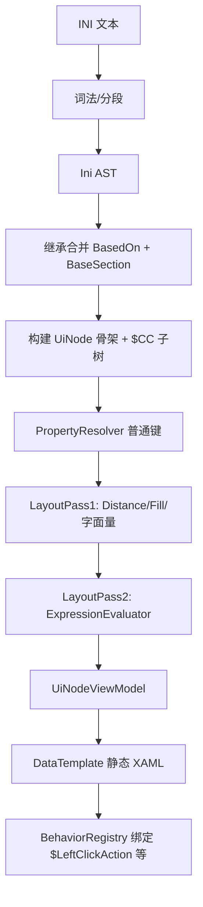

# INI 语法树、UiNode 序列化与布局策略评估

日期：2026-06-04  
状态：设计评审（待实现 AST 层）

## 1. 你的设想（归纳）

```
INI 文本
  → 语法树（AST）：识别 $CC*、$BaseSection、$LeftClickAction、$X/表达式、普通键
  → 语义合并（BasedOn / $BaseSection 继承）
  → UiNode Tree（结构 + Props + RawAttributes）
  → 「动态填充 XAML」：DataTemplate 绑定 Props
  → 布局：用 Margin 从根容器向下叠加，把局部 X/Y 映射到全局坐标
```

本文判断：**AST + UiNode 方向正确**；**布局不宜用 Margin 累加全局坐标**；**表达式不应放进 AXAML**。

---

## 2. 总体结论

| 环节 | 是否合理 | 建议 |
|------|----------|------|
| 魔改 INI → 语法树（AST） | ✅ 合理，且应做 | 在现有 `IniUiLoader` 前增加显式 AST 层，便于测试与 mod 兼容 |
| AST → UiNode Tree | ✅ 合理 | 与 `note/ini-ui-specification.md` 一致 |
| 动态填充 XAML | ⚠️ 需收窄语义 | **不要**运行时生成/解析 XAML 字符串；用 **固定 DataTemplate + 绑定 UiNode.Props** |
| 普通键 INI→XAML 映射 | ✅ 合理 | 按 `IniPropertyKind` + `ControlRegistry` 做 schema 映射（已实现雏形） |
| $CC* / $BaseSection / $LeftClickAction 分派 | ✅ 合理 | 分属 **结构 / 继承 / 行为** 三类 AST 节点，不要混进布局 Props |
| 布局：Margin 叠加做全局 X/Y | ❌ 不适合作为主方案 | 保持 **父容器相对坐标 + Canvas 定位**；表达式在 C# 两遍求值 |

---

## 3. 建议的 AST 分层

### 3.1 文件级（File AST）

```
IniFileNode
  ├── BasedOnChain: string[]          // [INISystem] BasedOn=...
  └── Sections: IniSectionNode[]
```

对应现有 `IniDocument.Load` + `CCIniFile`，应在 AST 层显式化，便于 golden 测试。

### 3.2 Section 级（Section AST）

```
IniSectionNode
  ├── Name: string
  ├── BaseSection: string?            // $BaseSection=SkirmishLobby（同文件 section 继承）
  ├── StructuralEntries: []           // $CC* → ChildDecl(name, typeName)
  ├── BehavioralEntries: []           // $LeftClickAction, 未来 Command 等
  ├── LayoutEntries: []               // $X/$Y/Location/Distance*/Fill*
  └── PropertyEntries: []           // Text, IdleTexture, Checked, SpawnIniOption...
```

**注意区分两种「继承」：**

| 机制 | 作用域 | AST 处理阶段 |
|------|--------|--------------|
| `[INISystem] BasedOn=` | 跨 **文件** 合并 section | File merge pass |
| `$BaseSection=` | 同 **文件** 内 section 键继承 | Section merge pass |

二者不应合并成一个 `$BaseSection=*` 概念，否则 mod 行为会对不齐。

### 3.3 表达式 AST（Layout AST）

```
ExprNode
  ├── Literal(int)
  ├── Constant(RESOLUTION_WIDTH | CHECKBOX_SPACING | ...)
  ├── Ref(controlName) + Accessor(getX|getY|getWidth|...)
  └── Binary(+, -, *, /)
```

**求值时机：** 仅在 **C# 布局阶段**（`ExpressionEvaluator` + `LayoutResolver`），输出写入 `UiNode.Props` 的数值字段。

**不要**把 `getWidth(btnOK)-4` 翻译成 AXAML `{Binding ...}` —— Avalonia 绑定没有 `getWidth(兄弟控件)` 这种跨节点布局函数。

---

## 4. 「动态填充 XAML」应如何理解

### 4.1 推荐（与现有 ClientAvalonia 一致）

```
UiNode (TemplateKey=DxButton, Props={ Text, CanvasLeft, Width, ... })
  → ContentControl + DxNodeTemplateSelector
  → 预编译 DataTemplate（DxControlStyles.axaml）
  → 绑定 UiNodeViewModel 的属性
```

- XAML **静态**、可审查、可热重载样式
- INI/mod 只改 **数据**（UiNode 树），不改 markup
- `$CC*` 动态性体现在 **运行时 UiNode 子树**，不是运行时 XAML

### 4.2 不推荐

- 运行时拼接 XAML 字符串 + `AvaloniaXamlLoader.Load`
- 原因：调试难、安全面、与 compiled binding 冲突、DPI/主题难统一

---

## 5. 布局方案评估：Margin 累加 vs Canvas

### 5.1 你的 Margin 思路（复述）

从根容器开始，每个容器设 Margin；子容器 Margin = 祖先 Margin 叠加 + 本地偏移，用 Margin 的加减把局部 X/Y 映射到全局空间。

### 5.2 为何不适合作为主方案

**（1）XNA INI 的 X/Y 语义是「相对直接父控件」，不是相对根**

- `btnLaunchGame` 与 `MapPreviewBox` 是 **同一父节点**（SkirmishLobby）下的 **兄弟**
- 表达式 `getY(btnLaunchGame)`、`getX(MapPreviewBox)` 跨兄弟引用
- Margin 嵌套链假设「子在内层容器里」；兄弟关系应用 **同一 Canvas 上的绝对偏移**，而不是层层 nest

**（2）重叠与 Z 序**

- 大厅 UI 大量重叠（装饰条、glow、按钮叠在面板上）
- `DrawOrder` / `ZIndex` 要求同层 siblings 可任意重叠
- 纯 Margin + 嵌套 Border 会 forced 文档流式布局，难以复现 overlap

**（3）FillWidth / DistanceFromRightBorder 改的是 Width/X，不是 Margin**

- `FillWidth=20` → `Width = parentW - 20`
- `DistanceFromRightBorder=25` → `X = parentW - selfW - 25`
- 这些在 XNA 里常 **覆盖** Location/X，必须在布局 pass 里算成 **最终 Width/CanvasLeft**，不是 Margin 能单独表达的

**（4）Avalonia Canvas 上 Margin 不是主定位手段**

- Canvas 子元素定位用 `Canvas.Left` / `Canvas.Top`（attached properties）
- Margin 在 Canvas 中行为与 Grid 不同，易造成与 XNA 像素不一致

**（5）表达式求值依赖「已算好的兄弟宽高」**

- 两遍构建：先建树 → 再对所有节点求 `$X/$Width/...`
- 求值时读的是 UiNode 树上各 control 的 **已解析几何**，与最终用 Margin 还是 Canvas 渲染无关
- **表达式层与渲染层应解耦**

### 5.3 推荐布局模型（与 XNA 对齐）

```
阶段 A（C#，布局解析）：
  对每个 UiNode，在「父控件坐标系」下求解：
    CanvasLeft, CanvasTop, Width, Height, ZIndex
  （含 Distance*/Fill*、表达式、常量 RESOLUTION_*）

阶段 B（Avalonia 渲染）：
  每个「容器型」UiNode → Border/Panel + 内层 Canvas
  每个子 UiNode → ContentControl @ Canvas.Left/Top, Width, Height, ZIndex
  （当前 DxNodeCanvasView 即此模型）
```

**不需要全局坐标：** 渲染时每层只关心 **相对父 Canvas** 的 Left/Top；全局位置由 Avalonia 布局树自动叠加。

若调试需要全局坐标，可在布局 pass 输出 `DebugGlobalX/Y`（遍历祖先相加），仅用于日志，不必进 AXAML。

### 5.4 Margin 的适用场景（辅助，非主路径）

| 场景 | 可用 Margin |
|------|-------------|
| 控件 **内部** 文本与边框间距 | ✅ 类似 XNA Padding |
| Grid 列内微调 | ✅ 官方 UI 新写时 |
| 复刻 mod INI 绝对像素大厅 | ❌ 主用 Canvas |

---

## 6. 特殊语法分派（AST → UiNode）

| 语法 | AST 类型 | UiNode 影响 | 渲染/行为 |
|------|----------|-------------|-----------|
| `$CC*` / ExtraControls | `ChildDecl` | 增加 `Children` | DataTemplate 递归 |
| `BasedOn` / `$BaseSection` | `InheritDecl` | 合并键到 section（加载期） | 不进入 Props |
| `$X/$Y/$Width/$Height` | `LayoutExpr` | → `CanvasLeft/Top/Width/Height` | Canvas |
| `Location`/`Size` | `LayoutShorthand` | 拆成 X/Y 或 W/H | 同上 |
| `DistanceFrom*` / `Fill*` | `LayoutOverride` | 覆盖 X/Y/W/H | 同上 |
| `$LeftClickAction` | `BehaviorDecl` | 进 `RawAttributes` 或 `Behaviors[]` | **Command/行为注册表**，非布局 |
| `Text`/`IdleTexture`/… | `PropertyDecl` | `Props` + 类型映射 | 绑定到模板 |
| 未知键 | `ExtensionDecl` | `RawAttributes` | `IIniExtensionConsumer` |

`$LeftClickAction=Disable` 当前 XNA 仅白名单；AST 应建模为 **BehaviorNode**，由 `BehaviorRegistry` 映射到 Avalonia Command/Gesture，而不是 XAML 属性。

---

## 7. INI 参数 →「XAML 参数」映射（澄清命名）

这里的「XAML 参数」应理解为 **Avalonia 绑定目标**（`UiNode.Props` 的 key），不必一一对应 XAML attribute：

| IniPropertyKind | Props Key（示例） | 模板绑定 |
|-----------------|-------------------|----------|
| String | Text, ToolTip | `{Binding Text}` |
| Bool | IsEnabled, IsVisible, IsChecked | 同名 |
| TexturePath | IdleTexture（资源路径） | Template 内 Image/Background |
| Expression | CanvasLeft, Width, … | 已求值为 double |
| Opaque（SpawnIniOption） | 保留 RawAttributes | 业务控件消费 |

**Label 特例：** `$AnchorPoint` / `$TextAnchor` 在 XNA 改的是绘制锚点；Avalonia 侧可转为 Canvas 定位 + TextAlignment，或 Label 专用模板，仍应在 **C# 预计算**，不塞进 AXAML 表达式。

---

## 8. 推荐流水线（定稿）



---

## 9. 相对现有 ClientAvalonia 的调整项

| 项 | 现状 | 建议下一步 |
|----|------|------------|
| AST | 无，Loader 直接读 IniDocument | 增加 `IniAstBuilder` + 单元测试（golden INI） |
| 布局 | Canvas.Left/Top ✅ | **保持**；文档化「不用 Margin 全局累加」 |
| 表达式 | C# ExpressionEvaluator ✅ | 扩展常量来源（ParserConstants INI） |
| 行为 | `$LeftClickAction` 未实现 | `BehaviorRegistry` + Command |
| XAML | DataTemplate ✅ | 禁止 runtime XAML gen |

---

## 10. 对你问题的直接回答

1. **语法树 + UiNode 序列化** — 合理，且比当前 imperative loader 更可维护；应对 `$CC` / 继承 / 行为 / 布局 / 普通属性分节点类型。

2. **动态填充 XAML** — 合理若指 **Template + 绑定**；不合理若指 **运行时生成 XAML**。

3. **Margin 做全局 X/Y 映射** — **不建议作为主方案**；兄弟重叠、FillWidth、跨控件表达式都无法稳定映射。应 **父相对坐标 + Canvas + C# 表达式两遍求值**。

4. **AXAML 能否支持原 INI 表达式** — **不能也不应**；表达式是布局 DSL，在 C# 求值后写入 Props 数值，AXAML 只绑定结果。

5. **若要局部→全局调试** — 在布局 pass 可选计算 `GlobalBounds` 用于日志/命中测试，与渲染坐标系分离。

---

## 11. 相关文档

- `note/ini-ui-specification.md` — 参数边界与类型
- `note/m0-key-ui-inventory.md` — 关键界面与表达式子集
- `note/clientavalonia-dx-components.md` — 当前实现
- `note/ini-to-avalonia-xaml-design-draft.md` — Canvas 兼容层（§0–§7）

---

## 12. 表达式的作用与分辨率策略（2026-06-04 收敛）

### 12.1 表达式在 INI 里到底解决什么

不单是「窗口变大变小」，而是 **在已知父容器/视口尺寸的前提下，算出控件相对父级的像素几何**：

| 表达式用途 | 典型写法 | 依赖什么 |
|------------|----------|----------|
| 视口尺度 | `$Width=RESOLUTION_WIDTH-40` | 当前渲染宽高常量 |
| 相对父级填充 | `FillWidth=16`、`DistanceFromRightBorder=25` | 父节点 Width/Height |
| 相对兄弟对齐 | `$Y=getY(btnLaunchGame)` | 兄弟节点已求值的几何 |
| 面板内排版 | `$Width=getWidth(lbMapList)-15` | 同层/子树控件尺寸 |

因此：**布局永远是「相对直接父控件」的局部坐标**（与 XNA 一致）；「全局」仅出现在 `RESOLUTION_*` 常量驱动的 **根窗口尺寸** 上。

求值发生在 **C# 布局 pass**，结果写入 `UiNode.Props`（`CanvasLeft/Top/Width/Height`）；AXAML 只绑定数值，不承载表达式。

### 12.2 预编译填充（已定方向）

```
UiNode Tree
  → TemplateKey → 预编译 DataTemplate（DxButton、DxPanel…）
  → Props → 绑定 Text、CanvasLeft、Width…
  → RawAttributes / BehaviorId → BehaviorRegistry（$LeftClickAction 等）
```

Template 映射可由 `ControlRegistry` 从 UiNode 直接得出；行为映射单独维护 **BehaviorRegistry**（与布局 Props 分离）。

### 12.3 分辨率策略：固定窗口 vs 多档重算

| 方案 | 做法 | 优点 | 缺点 |
|------|------|------|------|
| **A. 固定 1280×720** | 窗口不可 resize；表达式加载时求值一次 | 与官方 UI 设计基准一致；实现最简单；mod 兼容风险最低 | 其它分辨率需后续再做 |
| **B. 多档离散分辨率** | 用户选 1280×720 / 1280×800 / 1366×768…；切换时 **整树重跑 LayoutPass** | 对齐现有 `ScreenResolution`；重算成本低（O(节点数)） | 需 UI 设置与常量注入 |
| **C. 实时 drag resize** | 监听 SizeChanged 持续重算 | 最「现代桌面」 | 与 XNA 行为不一致；Canvas 子节点不自动跟随；工程量大、收益小 |

**推荐：分两阶段，不要一步做 C。**

1. **第一阶段（M2 验收）— 方案 A**  
   - 固定 **1280×720**、窗口不可 resize（与 `ini-to-avalonia-xaml-design-draft.md` §7.3、`MainMenu.ini` 一致）。  
   - `ExpressionEvaluator` 常量写死或通过 `LayoutContext { Width=1280, Height=720 }` 注入。  
   - **加载 INI 时求值一次**，之后 Props 不变。

2. **第二阶段（M5 显示选项）— 方案 B**  
   - 支持 **有限档位**（与 `ClientGUI/ScreenResolution` 合法列表交集，优先：1280×720、1280×800、1366×768、1920×1080 等）。  
   - 用户改分辨率 → 更新 `RESOLUTION_WIDTH/HEIGHT` + ParserConstants → 调用 `LayoutResolver.ApplyLayoutPass(tree)` → 刷新 `UiNodeViewModel`。  
   - **不做** 拖拽边改边算的连续 resize（除非日后有明确需求）。

重算实现要点（方案 B 很快）：

```csharp
void Relayout(UiNodeTree tree, LayoutContext ctx) {
  evaluator.SetResolution(ctx.Width, ctx.Height);
  layoutResolver.ApplyLayoutPass(tree);  // 已有两遍逻辑
  viewModel.RefreshFrom(tree.Root);      // 通知绑定更新
}
```

### 12.4 为何不建议第一阶段就做多档

- M0/M2 目标是 **主界面 + SkirmishLobby 能打开、布局不乱**；1280×720 已覆盖绝大多数官方/mod INI。  
- 多档本质是 **同一套表达式、不同常量再跑一遍**，不阻塞 AST/Template/Behavior 主线。  
- 现有 XNA 客户端也以固定渲染分辨率运行游戏式 UI，而非自由 resize 窗口。

### 12.5 决策记录

| 项 | 决策 |
|----|------|
| 坐标语义 | 相对直接父控件（局部），与 INI/XNA 一致 |
| 表达式位置 | 仅 C# LayoutPass，不进 AXAML |
| M2 分辨率 | **固定 1280×720，一次求值** |
| M5+ 分辨率 | **离散档位 + 全树重算**，不做 live resize |
| Template | UiNode.TemplateKey → 预编译 DataTemplate |
| 行为 | BehaviorRegistry，与 Props 分离 |
